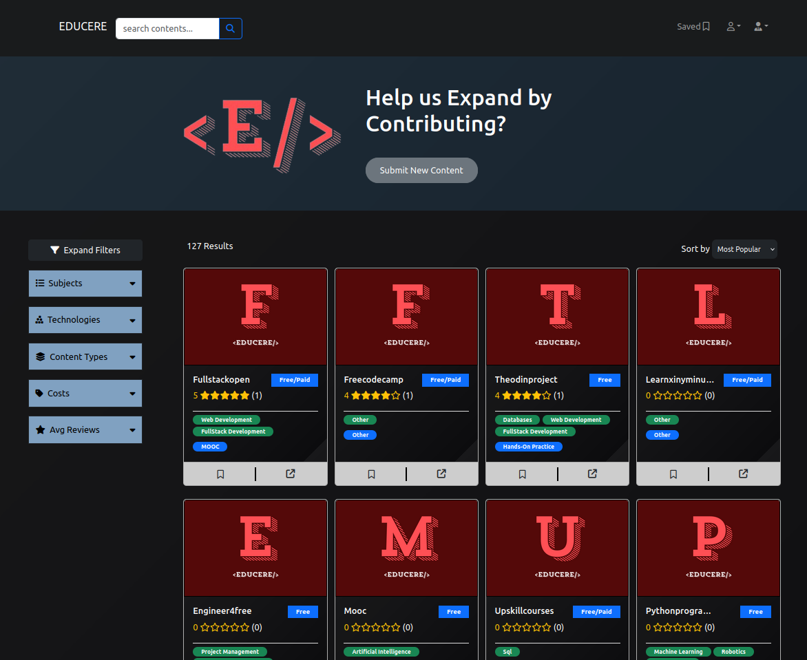
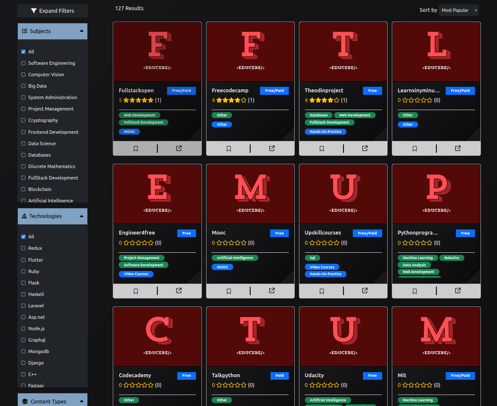
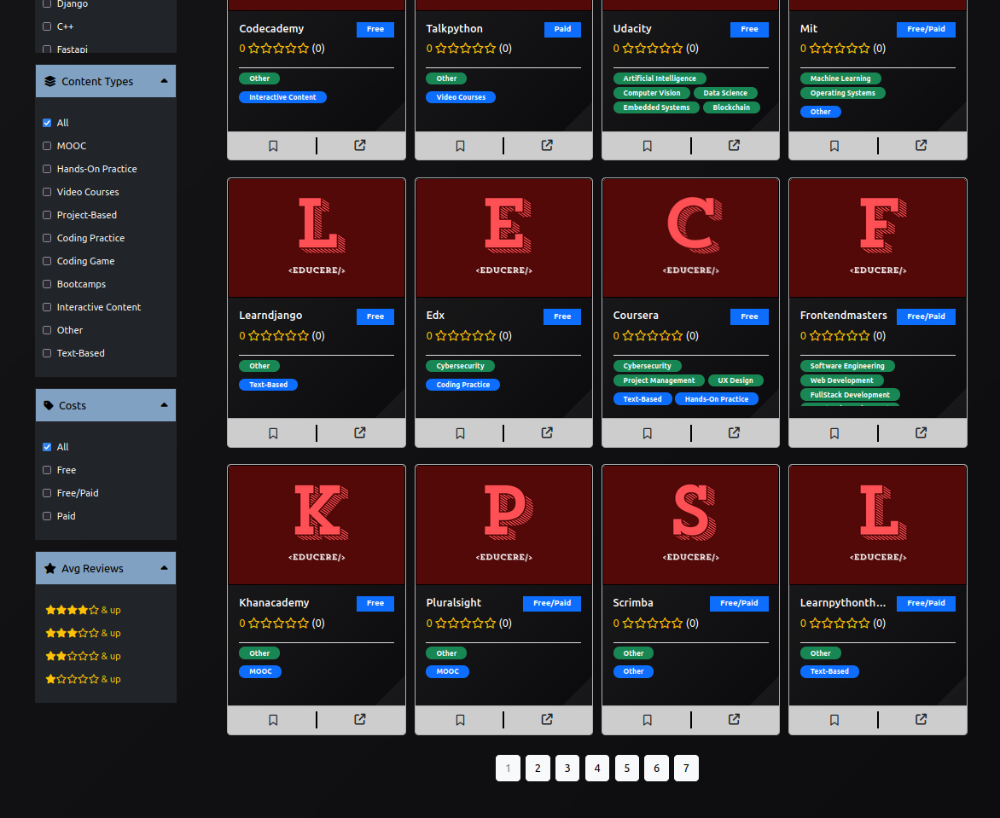
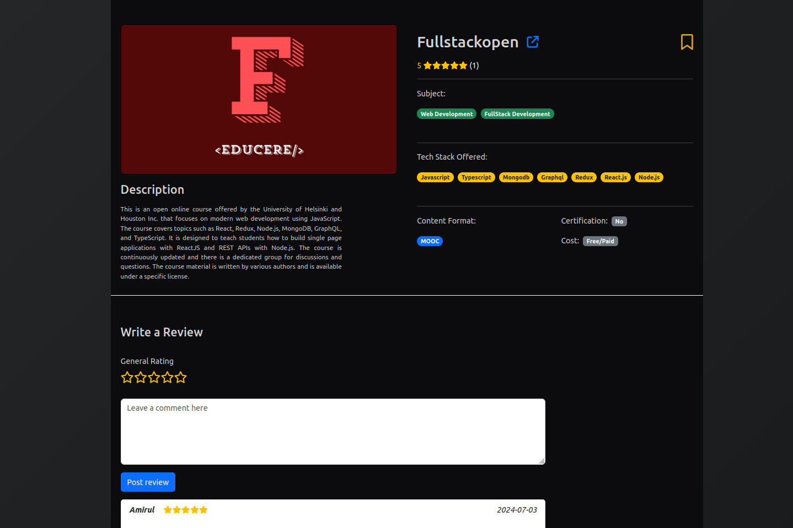
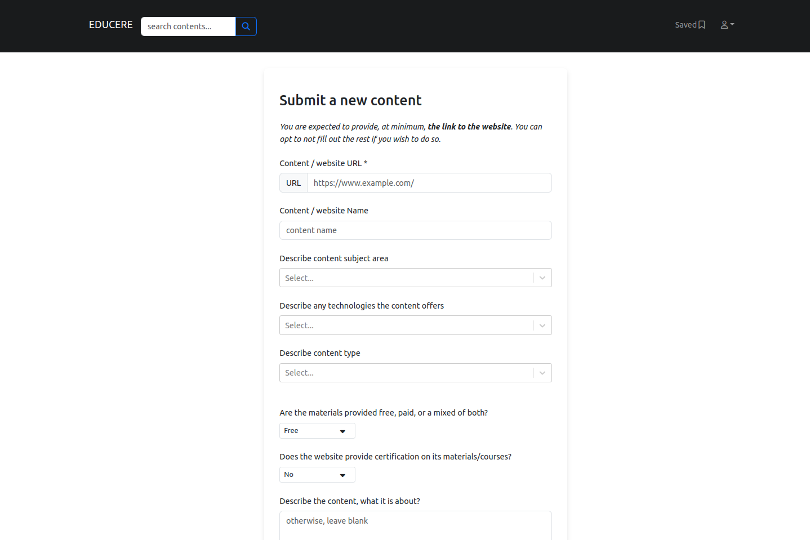

# Educere

Educere web application system is a repository of 100+ educational resources of CS and IT-based to help users in finding the perfect materials that suits their needs in a streamline way

## How to install

### Setup the MongoDB database

1. Setup MongoDB database locally or using Atlas

2. Add the database path inside .env file

### Setup the project by installing dependencies

3. Clone/download the project in your local environment

4. Navigate to the frontend directory and
   run `npm install` to install all frontend dependencies

5. Navigate to the backend directory and
   run `npm install` to install all backend dependencies

### Start the project

6. Start your MongoDB database
   Locally: Run `sudo systemctl start mongod`
   Remotely: Start in your Atlas account

7. Navigate to the backend directory
   run `npm run dev` to start the backend on localhost:8000

8. Navigate to the frontend directory
   run `npm run dev` to start the frontend on localhost:5173 (vite)

## Seed the application with data

    run `http://localhost:8000/api/seed` in browser to seed all data into the database and the system

## Interface:

1. Search and Filter Interface

The user can search contents by name or filter options

2.

