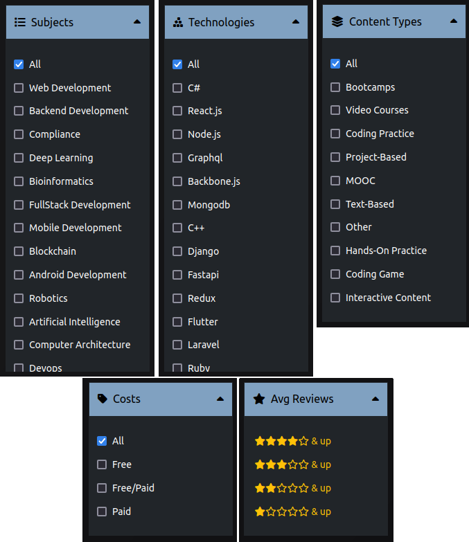

# Educere

Educere web application system is a repository of 100+ educational resources of CS and IT-based to help users in finding the perfect materials that suits their needs in a streamline way

## How to install

### Setup the MongoDB database

1. Setup MongoDB database locally or using Atlas

2. Add the database path inside .env file

### Setup the project by installing dependencies

3. Clone/download the project in your local environment

4. Navigate to the frontend directory and
   run `npm install` to install all frontend dependencies

5. Navigate to the backend directory and
   run `npm install` to install all backend dependencies

### Start the project

6. Start your MongoDB database
   Locally: Run `sudo systemctl start mongod`
   Remotely: Start in your Atlas account

7. Navigate to the backend directory
   run `npm run dev` to start the backend on localhost:8000

8. Navigate to the frontend directory
   run `npm run dev` to start the frontend on localhost:5173 (vite)

## Seed the application with data

    run `http://localhost:8000/api/seed` in browser to seed all data into the database and the system

## Interface:

### 1. Search Page

User can search contents by name or filter options at the side

### 2. Filter Options

User can filter contents by 5 filter options Subjects, Technologies, Types, Costs, and Average Reviews

### 3. Content Page

User can view more details of a content in the content page

### 3. Save/Bookmark Page

User can view all saves in the saved page

### 4. Content Dashboard

Admin can manage contents in the content dashboard. Action features include create/add content, edit content, and delete content

### 5. Submission Dashboard

Admin can manage user submission in the submission dashboard. Actions features include approve and reject button to accept or delete user's submission

### 6. Content Dashboard

Admin can manage user's in the user dashboard. Actions include edit and delete user

### 7. Summary Dashboard

This page contain the summaries of all contents. It shows the total numbers of contents, users, and admin available in the system. Additionally, admin can view the percentages of content's filter in pie chart

### 8. Submission Page

User can contribute in expanding the website's contents by sharing a learning resource link and get admin's approval

### 9. Content Dashboard

Signup page

### 10. Content Dashboard

Signin page

### 11. Content Dashboard

User profile page

